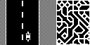
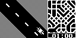
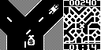

# Randocity

## Screenshots

## Overview

Arduboy large open-world procedurally generated city motorcycle game with 3 play modes.
* The city is 256x256 blocks with each block being 64x64 tiles and each tile is 8x8 pixels. 
* Assuming a block is 100m, then the random city is about the size of El Paso, TX
  * 100m/block * 256 block = 25.6km ~= 15.9 miles
  * (15.9 miles)2 = 252.8 miles2
  * El Paso is about 255.2 miles2
* The city is generated from a random seed.  But a given seed will always produce the exact same city.
  * The underlying algorithm uses an LFSR (linear feedback shift register) for the random element, but for a given seed the sequence is always the same.
  * Currently using a 20-bit LFSR (4 bits for a block _x_ 256 blocks wide _x_ 256 block high -> 20 bits.
  * Could easily use larger LFSR for larger maps.  (32 bits would allow a 16k by 16k city with 4 bit blocks)
## Controls
* Left/Right buttons turn
* B button accelerates each time it is pressed
* A button brakes each time it is pressed
* Going off road will stop the motorcycle.  To get back on the road, press B repeatedly.
* Holding the Down button and pressing A will pause the game and allow the player to resume or exit.
## Game Modes
* Free Play - expore the city at your own pace.
* Race to the Edge - start out in the middle of the city and try to reach any edge as fast as you can.
  * Fastest times are stored along with the map seed so you can try to beat your record or get share your seed with a friend to see if they can do better.
* Crazy Courier - pick up randomly placed packages. The faster you pick them up, the more points you get. But if the timer reaches zero, its game over.
  * Highest scores are saved along with the map seed.
## Other Features
* Records - see the fastest Edge Race time or highest Crazy Courier score.
* View Map - scroll through the mini-map to see how the map is laid out. Also allows you to change the seed.
* Help - brief description of controls and games.
